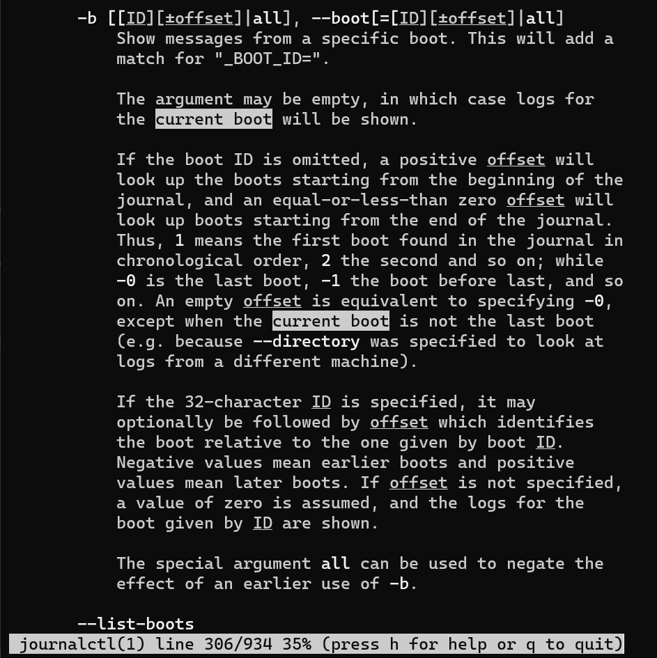
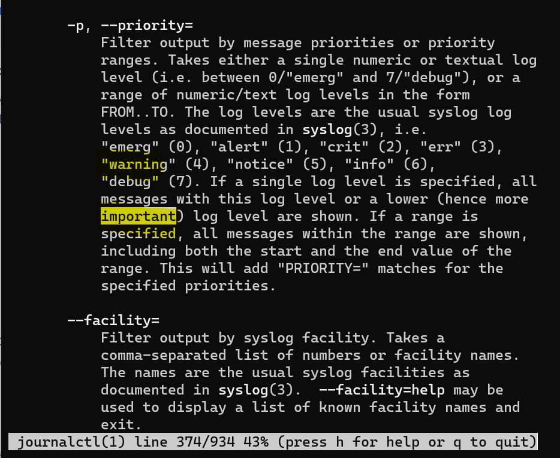
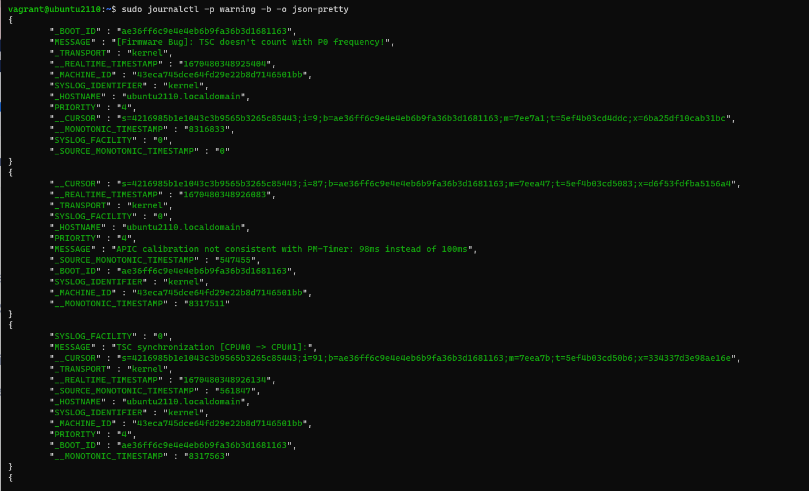

## Exam 2420
**Simon Freeman A01074210**

## Part 1
sudo app update && sudo apt upgrade

## Part 2
1. To search for eco, I typed /eco and hit enter
2. I then typed `cgn` to delete the occurence of the word echo
3. I then typed `echo` in the location where eco was deleted
4. To change the 1 to a 0 in the if statament, I used /0 to find the 0 and hit enter
5. I then typed `cgn` to delete the occurence of the word echo
6. I repeated this process for each instance of eco
7. I then typed 0 to replace to make it so the echo command would work if no arguments were passed


## Part 3

### Finding current boot command
I typed `man journalctl` to get into the man page.

To search for the commands, I typed the `/` followed by a word, and used `n` to skip through the words until I found something useful.

To find the current boot command, I typed `/current boot`, which brought me to the -b command.



To find the command to prioritze warnings or more important, I typed `/priority` and found the -p command, which mentions priority levels.


To find out how to create output in pretty json, I searched for `/pretty` in the mange page, which brought me to `json-pretty`, which is part of the `-o` option.


Using all of these commands in combination with sudo gave me this output:

```bash
sudo journalctl -p warning -b -o json-pretty
```



